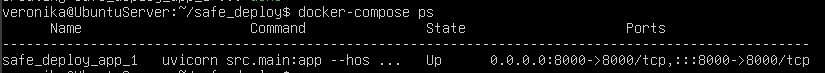
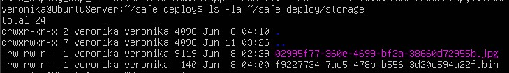

# Безопасность лаба 11
## 1. Скриншот команды docker-compose ps на сервере (статус Up).

## 2. Скриншот содержимого папки storage на сервере (вне контейнера), подтверждающий работу volume (файлы появляются на хосте).

