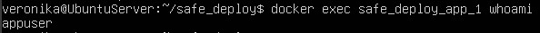
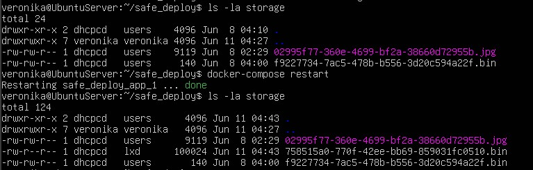

# Безопасность лаба 12
## 1. Скриншот команды whoami внутри контейнера (результат: не root).

## 2. Текстовый файл с отчетом сканера Trivy.

[отчет сканера trivy.log](trivy_report.txt)

## 3. Скриншот работающей загрузки файлов на сервере (подтверждение, что права доступа настроены верно).

первый storage - до добавления файла, второй - после  
