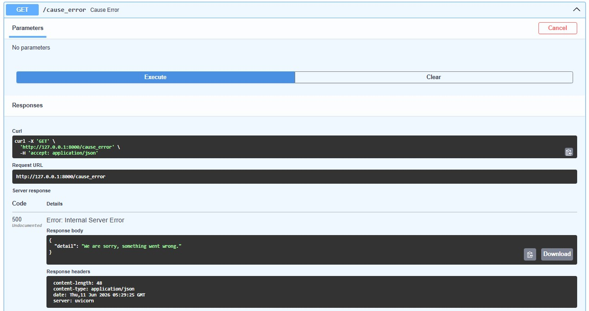
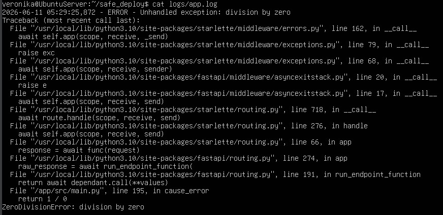
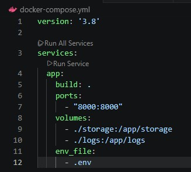

# Безопасность лаба 13
## 1. Скриншот ответа сервера на /cause_error (красивый JSON, без стектрейса).

## 2. Скриншот файла logs/app.log с сервера, где виден ваш Traceback ошибки и запись о неудачном входе.

## 3. Скриншот docker-compose.yml с подключенным volume для логов.

первый storage - до добавления файла, второй - после  
