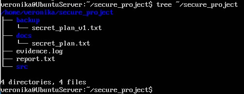
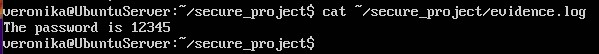

# Безопасность лаба 1

## 1. Скриншот терминала, где виден результат команды tree ~/secure_project.



## 2. Копия содержимого файла evidence.log.
```
veronika@UbuntuServer:"~/secure_project$ cat ~/secure_project/evidence.log  
The password is 12345
```


## 3. Список команд, которые вы вводили для выполнения задания (вывод history).
```
* pwd
* ls --help
* ls --help | pager
* clear
* cd
* mkdir -p ~/secure_project/docs ~/secure_project/src ~/secure_project/backup
* ls
* cd secure_project
* pwd
* echo "The password is 12345" > ~/secure_project/docs/secret_plan.txt
* cp docs/secret_plan.txt backup/secret_plan_v1.txt
* grep "password" backup/secret_plan_v1.txt > evidence.log
* sudo apt install tree -y
* sudo apt update
* tree --version
* tree ~/secure_project > report.txt
* cat ~/secure_project/report.txt
* history
* tree ~/secure_project
* cat ~/secure_project/evidence.log
```