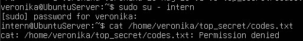
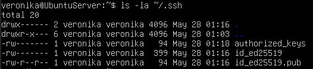

# Безопасность лаба 2

## 1. Вывод команды ls -ld top_secret (показать права на папку).
```
veronika@UbuntuServer:~$ ls -ld top_secret
drwx------ 2 veronika veronika 4096 May 28 01:03 top_secret
```
## 2. Вывод команды ls -l top_secret/codes.txt (показать права на файл).
```
veronika@UbuntuServer:~$ ls -l top_secret/codes.txt
-rw------- 1 veronika veronika 26 May 28 01:03 top_secret/codes.txt
```
## 3. Скриншот попытки чтения файла от имени пользователя intern (с ошибкой Permission denied).



## 4. Вывод команды ls -la ~/.ssh (показать права на ключи).

