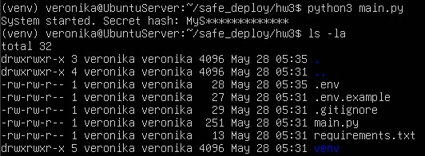

# Безопасность лаба 3

## 1. Ссылка на репозиторий на GitHub 

https://github.com/emynessly/safe_deploy

## 2. Скриншот терминала Linux, на котором видно:

1. Команду запуска python3 main.py.
2. Вывод программы: "System started. Secret hash: MyS**"*.
3. Вывод команды ls -la, подтверждающий наличие файла .env (которого нет на GitHub).

