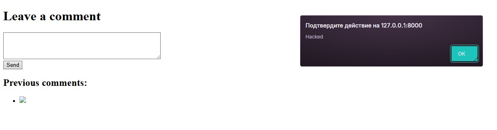
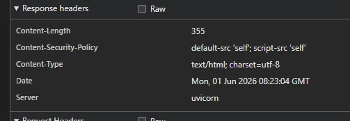

# Безопасность лаба 6

## 1. Скриншот успешной XSS-атаки (до защиты).



## 2. Пример кода функции-санитизера.
```python
def clean_text(text: str) -> str:
    cleaned = bleach.clean(text, tags=ALLOWED_TAGS, strip=True)
    return Markup(cleaned)
```
## 3. Скриншот заголовков ответа (вкладка Network), где виден CSP.

