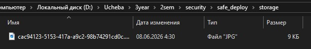
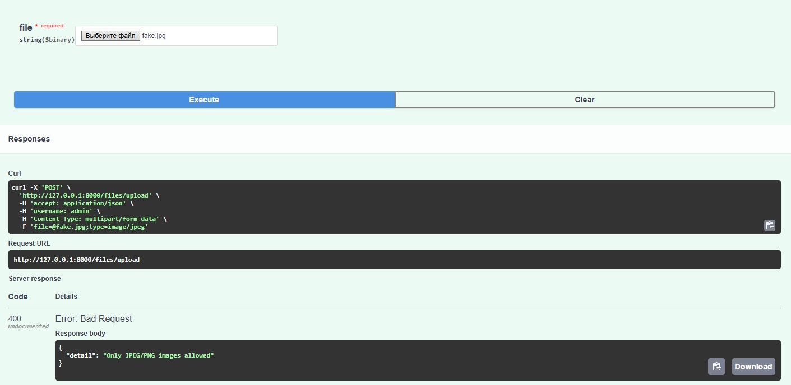
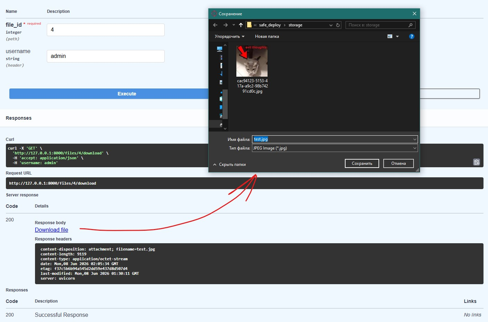

# Безопасность лаба 9
## 1. Скриншот папки storage, где лежат файлы с UUID-именами.

## 2. Скриншот ответа сервера при попытке загрузить fake.jpg (текстовый файл с неправильным расширением).

## 3. Скриншот успешного скачивания файла (в браузере видно оригинальное имя).

